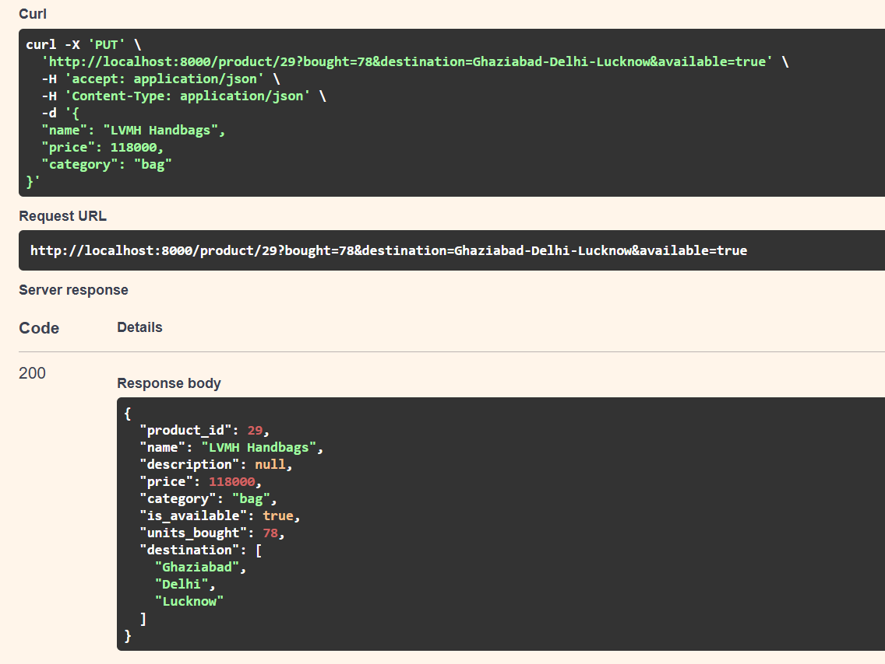

# BACKEND Programming using FAST API

### DAY 4 [19-01-2025] => MISSED!
### DAY 5 [20-01-2025] => MISSED!
### DAY 6 [21-01-2025]

## Request Body
- You can send them using get (but it's discouraged). Also swagger ui won't show documentation 
- So we use post, put, delete methods and use Pydantic Model
- Minor mistake you make: setting default value in pydantic model
```python
discount: float|20.5 # Wrong ❌
discount: float=20.5 # Right ✅
```
```python
@app.post("/items/")
def post_item(item:Item): # where Item is Pydantic BaseModel Class
    return item # NOT Item
```
- Creating Pydantic model is a good practice and also it gives type support unlike using dict
- item.model_dump() command to get a dict object of the item Pydantic Class

```python
    stuff ={"product_id":product_id}
    stuff.update(product.model_dump())
    
    stuff= {"product_id":product_id, **product.model_dump()}
    # BOTH SAME THINGS
    # **product.model_dump() => Unpacking the product in stuff dictionary 
```

### You can use PUT to provide a path parameter along with requesting data from user


